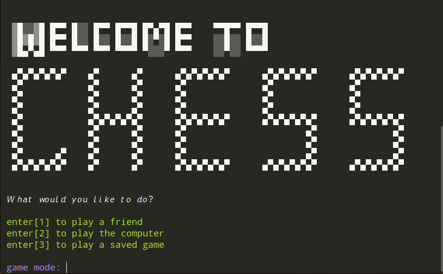

# Ruby Chess Game

This game is the [capstone project](https://www.theodinproject.com/courses/ruby-programming/lessons/ruby-final-project?ref=lnav) for the The Odin Project's Ruby Programming curriculum.

## Demo

*A short demonstration of* [The Opera Game](https://www.chess.com/terms/opera-game-chess), *a famous 1858 match between Paul Morphy and Duke Karl.*

***

## Gameplay

At the welcome screen, you'll be prompted to select a game mode. Your choices are

1. play a friend (2P)
2. play the computer (computer makes a random move or capture)
3. play a saved game (load a saved game if any are available)

During any player move, you have commands available to you.
commands: save | load | help | quit | resign | draw

Game will resume progress after saving.

### How to move pieces

This game uses traditional [algebraic notation](https://en.wikipedia.org/wiki/Algebraic_notation_(chess)) to enter moves. However, no extra characters are required when making special moves such as "+" for check or "e.p." to en passsant attack
Attack moves must preface destination square with an "x".

Every piece except the pawn is assigned a piece prefix:

  - King   => K
  - Queen  => Q
  - Rook   => R
  - Knight => N
  - Bishop => B

  - pawns      =>   e5, exd6, a5, axb6 . . .
  - others     =>   Ke7, Kxe7, Nc3, Nxc6 . . .
  - castling   =>   0-0 (king-side). 0-0-0 (queen-side)
  - en passant =>   exd6 (attack as if enemy has just moved one square)
      

Moves are case sensitive.

##### Move Disambiguation

- If disambiguation is required (two or more pieces of the same type can go to the same square), you'll be prompted to choose which piece you'd like to move.

##### Pawn Promotion

- If one of your pawns reaches its final rank, you will be prompted to promote it to either a Queen, Rook, Knight, or Bishop

##### En Passant Attacks

- Follows en passant rules. Only possible if most recent enemy move was a two-square pawn move

##### Castling

Castling is only possible if the following are true:

- Your King is not currently in check
- Neither your King nor your relevant Rook has moved previously
- No opponent pieces can attack your King's castling path.

##### Checkmate and Stalemate

- Checkmate => A player has no legal moves and their king is in check.
- Stalemate => A player has no legal moves and their king is not in check.
- Game will conclude upon either stalemate or checkmate

***

### Reflection

Coding this chess game was extremely challenging. I feel like I've become a better programmer in the process, and I've learned a lot about what I would do differently. I learned I need to pay more attention to overall OOP design principles. I will spend more time planning overall code structure in the future. 

I also learned the importance of testing. I made this a lot harder on myself by writing the majority of my tests after the basic functionality was written. This made it a lot harder than necessary to debug (although I did get good practice using pry-byebug).
